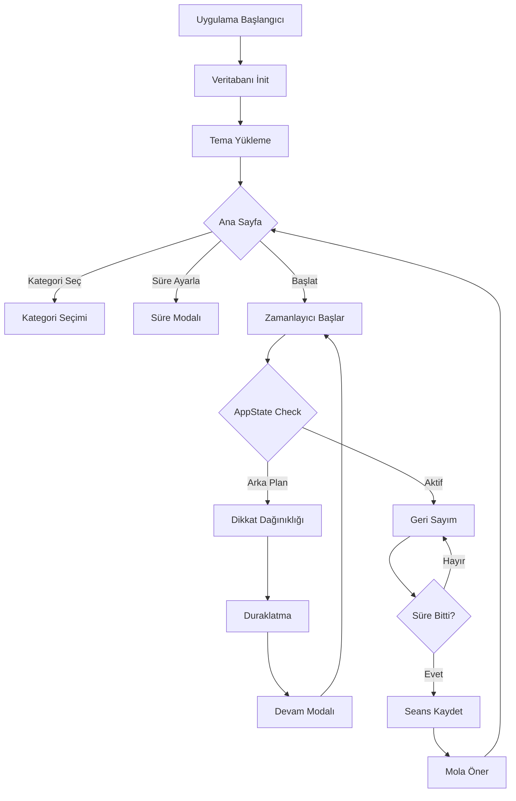

# 🎯 FocusTracker

<div align="center">


[](https://reactnative.dev/)
[](https://expo.dev/)
[](https://www.sqlite.org/)

**Dijital dikkat dağınıklığıyla mücadele edin, verimliliğinizi artırın**

[Özellikler](#-özellikler) • [Kurulum](#-kurulum) • [Kullanım](#-kullanım) • [Mimari](#-mimari) • [Katkıda Bulunma](#-katkıda-bulunma)

</div>

---

## 📖 Hakkında

**FocusTracker**, Pomodoro tekniğini temel alarak geliştirilmiş, modern ve kullanıcı dostu bir mobil üretkenlik uygulamasıdır. Odaklanma sürelerinizi takip edin, kategorize edin ve detaylı grafiklerle analiz edin.

> 🎓 **BSM 447 - Mobil Uygulama Geliştirme** dersi dönem projesi olarak geliştirilmiştir.

### 🌟 Neden FocusTracker?

- **🚫 Akıllı Dikkat Dağınıklığı Tespiti**: Uygulamadan her çıkışınız otomatik olarak algılanır ve kaydedilir
- **📊 Derinlemesine Analiz**: Günlük, haftalık ve aylık performans raporları
- **🎨 Kişiselleştirilmiş Deneyim**: Karanlık/aydınlık mod ve özel kategoriler
- **💾 Tamamen Offline**: Tüm verileriniz cihazınızda güvende

---

## ✨ Özellikler

### ⏱️ Akıllı Zamanlayıcı
- Görsel olarak çekici dairesel ilerleme çubuğu
- Özelleştirilebilir çalışma süreleri (5, 15, 25, 45, 60 dakika)
- Otomatik duraklatma ve devam ettirme
- Pomodoro döngü sistemi (4 çalışma + uzun mola)

### 🚫 Dikkat Dağınıklığı Takibi
- **AppState API** ile gerçek zamanlı uygulama durumu izleme
- Arka plana geçişlerin otomatik tespiti
- Her dağılma için timestamp ve süre kaydı
- Görsel uyarılar ve geri dönüş önerileri

### 📂 Kategori Yönetimi
- Sınırsız özel kategori oluşturma
- 12+ hazır renk paleti
- Kategori bazlı istatistikler
- Kategori düzenleme ve silme (veri bütünlüğü korunur)

### 📊 Detaylı Raporlama
- **Pasta Grafikleri**: Kategori dağılımı
- **Çubuk Grafikleri**: Haftalık performans trendi
- **İstatistik Kartları**: Toplam odaklanma, ortalama süre, en verimli gün
- Filtreli görünümler: Bugün / Bu Hafta / Tüm Zamanlar

### 🎨 Kullanıcı Deneyimi
- Modern ve minimal arayüz tasarımı
- Koyu/Açık tema desteği (sistem teması ile senkron)
- Animasyonlu geçişler ve mikro-etkileşimler
- Responsive tasarım (her ekran boyutuna uyumlu)

### 🔒 Güvenlik ve Veri Bütünlüğü
- Aktif seans sırasında kritik ayarların kilitlenmesi
- SQLite ile tamamen yerel veri saklama
- Kategori silme koruma sistemi
- AsyncStorage ile kullanıcı tercihleri yedekleme

---

## 🛠️ Teknoloji Yığını

| Teknoloji | Versiyon | Kullanım Alanı |
|-----------|----------|----------------|
| **React Native** | Latest | Çapraz platform mobil geliştirme |
| **Expo SDK** | 52 | Geliştirme ve derleme framework'ü |
| **SQLite** | expo-sqlite | Yerel veritabanı yönetimi |
| **React Navigation** | v6 | Sayfa yönlendirme (Bottom Tabs) |
| **Chart Kit** | react-native-chart-kit | Grafik ve görselleştirme |
| **AsyncStorage** | @react-native-async-storage | Kullanıcı tercihleri saklama |
| **Expo Vector Icons** | Latest | İkon seti |

---

## 📂 Proje Mimarisi

FocusTracker, **Clean Architecture** ve **Feature-Based** prensiplere uygun olarak modüler bir yapıda geliştirilmiştir.

```
src/
├── 📱 screens/              # Ana uygulama ekranları
│   ├── HomeScreen.js        # Zamanlayıcı ve odaklanma ekranı
│   ├── ReportsScreen.js     # İstatistik ve grafikler
│   └── SettingsScreen.js    # Ayarlar ve kategori yönetimi
│
├── 🧩 components/           # Yeniden kullanılabilir UI bileşenleri
│   ├── timer/               # Zamanlayıcı bileşenleri
│   │   ├── CircularProgress.js
│   │   ├── TimerControls.js
│   │   └── TimePickerModal.js
│   ├── category/            # Kategori bileşenleri
│   │   ├── CategorySelector.js
│   │   ├── CategoryButton.js
│   │   └── CategoryManagementModal.js
│   ├── reports/             # Rapor bileşenleri
│   │   ├── PieChart.js
│   │   ├── BarChart.js
│   │   └── StatCard.js
│   ├── distraction/         # Dikkat dağınıklığı bileşenleri
│   └── common/              # Genel bileşenler
│
├── 🎣 hooks/                # Custom React Hooks (Business Logic)
│   ├── useTimer.js          # Zamanlayıcı state ve logic
│   ├── useCategories.js     # Kategori CRUD işlemleri
│   ├── useSessionStats.js   # İstatistik hesaplamaları
│   └── useAppState.js       # Uygulama durumu takibi
│
├── 🔧 services/             # Veritabanı servisleri
│   ├── SessionService.js    # Seans CRUD işlemleri
│   ├── CategoryService.js   # Kategori CRUD işlemleri
│   └── TimerService.js      # Zamanlayıcı yardımcıları
│
├── 🌐 context/              # Global State Management
│   ├── ThemeContext.js      # Tema yönetimi
│   └── SessionContext.js    # Aktif seans kilitleme
│
├── 🎨 styles/               # Global stiller
│   ├── colors.js            # Renk paleti
│   ├── typography.js        # Yazı tipleri
│   ├── spacing.js           # Boşluk sistemleri
│   └── commonStyles.js      # Ortak stil tanımları
│
├── 🛠️ utils/               # Yardımcı fonksiyonlar
│   ├── db.js                # SQLite kurulum ve bağlantı
│   ├── constants.js         # Sabit değerler
│   ├── timeFormatter.js     # Süre formatları (mm:ss)
│   └── validators.js        # Girdi doğrulama
│
└── 🧭 navigation/           # Navigasyon yapılandırması
    └── AppNavigator.js      # Tab Navigator setup
```

### 🏗️ Mimari Prensipleri

1. **Separation of Concerns**: UI ve business logic tamamen ayrılmıştır
2. **Single Responsibility**: Her dosya tek bir sorumluluğa sahiptir
3. **DRY Principle**: Ortak kodlar components ve hooks içinde yeniden kullanılabilir
4. **Clean Code**: ESLint ve Prettier ile kod kalitesi korunur

---

## 💾 Veritabanı Şeması

### `categories` Tablosu
```sql
CREATE TABLE categories (
  id INTEGER PRIMARY KEY AUTOINCREMENT,
  name TEXT UNIQUE NOT NULL,
  color TEXT NOT NULL
);
```

### `sessions` Tablosu
```sql
CREATE TABLE sessions (
  id INTEGER PRIMARY KEY AUTOINCREMENT,
  category TEXT NOT NULL,
  date TEXT NOT NULL,
  duration INTEGER NOT NULL,
  distractions INTEGER DEFAULT 0
);
```

> 💡 **Not**: Kategori silinse bile, veri bütünlüğü korunur. Geçmiş seanslar silinmez, yalnızca rengi gri olarak gösterilir.

---

## 🚀 Kurulum

### Gereksinimler
- Node.js (v16 veya üzeri)
- npm veya yarn
- Expo Go uygulaması (mobil test için)

### Adım Adım Kurulum

1. **Depoyu klonlayın**
```bash
git clone https://github.com/Yusufygc/Odaklanma_Uygulamasi.git
cd Odaklanma_Uygulamasi/FocusTracker
```

2. **Bağımlılıkları yükleyin**
```bash
npm install
# veya
yarn install
```

3. **Uygulamayı başlatın**
```bash
npx expo start -c
```

4. **Test edin**
- Telefonunuza **Expo Go** uygulamasını indirin
- Terminalde çıkan QR kodu taratın
- Veya emülatör/simulator kullanın

---

## 📱 Kullanım

### Hızlı Başlangıç

1. **İlk Kategori Oluşturma**
   - Ayarlar sekmesine gidin
   - "Kategori Ekle" butonuna tıklayın
   - Kategori adı ve renk seçin

2. **Odaklanma Seansı Başlatma**
   - Ana ekranda kategori seçin
   - Süreyi ayarlayın (varsayılan 25 dakika)
   - "Başlat" butonuna tıklayın

3. **Dikkat Dağınıklığı Takibi**
   - Seans sırasında uygulamadan çıkarsanız
   - Otomatik olarak duraklatılır
   - Geri döndüğünüzde devam ettirebilirsiniz

4. **Raporları Görüntüleme**
   - Raporlar sekmesine gidin
   - Günlük/Haftalık/Tüm Zamanlar filtrelerini kullanın
   - Grafikler ve istatistikleri inceleyin

---

## 🎨 Ekran Görüntüleri

### Ana Sayfa - Odaklanma


### Raporlar - İstatistikler


### Ayarlar - Kategori Yönetimi


---

## 🔄 Uygulama Akışı



---

## 🧪 Test Senaryoları

- ✅ Zamanlayıcı başlatma ve durdurma
- ✅ Arka plana geçişte otomatik duraklatma
- ✅ Kategori ekleme, düzenleme, silme
- ✅ Aktif seans sırasında ayar kilitleme
- ✅ İstatistik hesaplama doğruluğu
- ✅ Tema değiştirme ve kalıcılık
- ✅ Veri tabanı CRUD işlemleri

---

## 🤝 Katkıda Bulunma

Bu proje bir dönem ödevi olarak geliştirilmiştir ve şu anda dış katkılara kapalıdır. Ancak projeyi fork'layıp kendi geliştirmelerinizi yapabilirsiniz.

### Geliştirme Planı
- [ ] Bildirim sistemi entegrasyonu
- [ ] Bulut yedekleme (Firebase/Supabase)
- [ ] Widget desteği
- [ ] Sosyal özellikler (arkadaşlarla rekabet)
- [ ] Dark pattern analizi

---

## 👨‍💻 Geliştirici

**Yusuf YGC**
- GitHub: [@Yusufygc](https://github.com/Yusufygc)
- Üniversite: BSM 447 - Mobil Uygulama Geliştirme

---

## 📚 Referanslar

- [React Native Docs](https://reactnative.dev/docs/getting-started)
- [Expo Documentation](https://docs.expo.dev/)
- [Pomodoro Technique](https://francescocirillo.com/pages/pomodoro-technique)
- [Clean Architecture](https://blog.cleancoder.com/uncle-bob/2012/08/13/the-clean-architecture.html)

---

<div align="center">

**⭐ Projeyi beğendiyseniz yıldız vermeyi unutmayın!**

Made with ❤️ by [Yusuf YGC](https://github.com/Yusufygc)

</div>s
